# Moo harness walkthrough

This is a code-oriented tour of the Moo harness: how the Rust host, V8 runtime, TypeScript `moo` API, SQLite store, Solid web shell, and external providers cooperate during an agent turn.

Use this alongside the source map in [`README.md`](../README.md). The most important directories are:

| Path | Role |
| --- | --- |
| [`src/`](../src/) | Rust binary, HTTP/WebSocket server, V8 runtime, worker pool, and native ops. |
| [`harness/src/`](../harness/src/) | TypeScript harness loaded into V8; defines `globalThis.moo` and command handlers. |
| [`web/src/`](../web/src/) | Solid UI for chats, timeline, memory, traces, MCP, apps, diffs, and Markdown. |
| [`docs/`](./) | Static public website and long-form repository documentation. |

## 1. The whole system

Moo is a local-first agent workbench. The binary owns the durable store and native capabilities; the TypeScript harness gives agents a high-level API; the web app is an inspector and control surface.

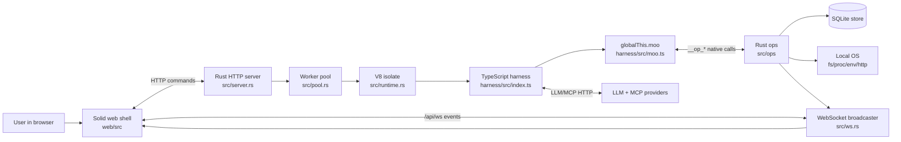

The boundary to keep in mind:

- **Rust** decides what native capabilities exist and persists state.
- **TypeScript harness** decides how agent-visible APIs and commands compose those primitives.
- **Web UI** calls commands and renders state; it does not directly execute tools.

## 2. Boot path

The binary starts a local server, serves the embedded web app, and routes command requests into worker jobs that execute the bundled harness in V8.

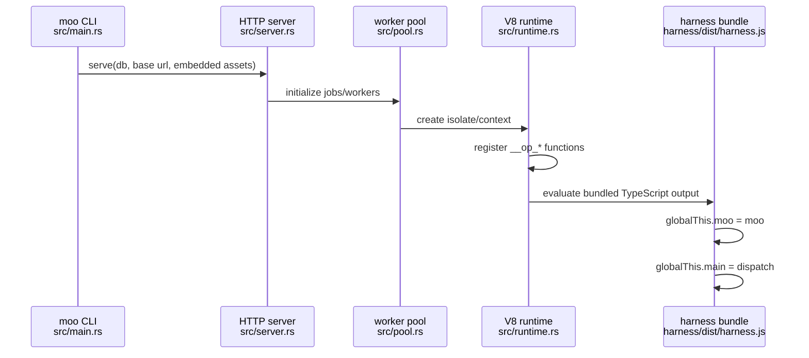

Important entrypoints:

- [`src/main.rs`](../src/main.rs): CLI, database path, subcommands, server startup.
- [`src/server.rs`](../src/server.rs): static UI routes, `/api/ws`, raw-file preview routes, request handling.
- [`src/pool.rs`](../src/pool.rs): job scheduling and V8 worker lanes.
- [`src/runtime.rs`](../src/runtime.rs): V8 setup, async op settlement, JS function registration.
- [`harness/src/index.ts`](../harness/src/index.ts): installs `moo` and `main` on `globalThis`.

## 3. Command dispatch

Every UI/API action arrives at the harness as an input object with a command. [`harness/src/commands.ts`](../harness/src/commands.ts) is the central router.

```mermaid
flowchart TD
  Input["Input JSON<br/>cmd, chatId, payload"] --> Main["globalThis.main(input)"]
  Main --> Dispatch[dispatch(input)]
  Dispatch --> Trace[startTraceRoot]
  Trace --> Map{COMMANDS[cmd]}
  Map --> Step[step/resume/tick/submit<br/>commands/step.ts]
  Map --> Memory[memory/object/pointer/vocab<br/>commands/memory.ts]
  Map --> Chat[chats/messages<br/>commands/chats.ts]
  Map --> UI[apps/ui state<br/>commands/ui.ts]
  Map --> MCP[MCP config/calls<br/>commands/mcp.ts]
  Map --> Auth[LLM auth/model settings<br/>commands/llm_auth.ts]
  Step --> Result[JSON-ish result]
  Memory --> Result
  Chat --> Result
  UI --> Result
  MCP --> Result
  Auth --> Result
  Result --> Finish[finishTraceRoot]
```

The command layer is deliberately thin: it validates and normalizes request shape, then calls lower-level helpers in [`agent.ts`](../harness/src/agent.ts), [`steps.ts`](../harness/src/steps.ts), and [`moo.ts`](../harness/src/moo.ts).

## 4. The `moo` API facade

[`harness/src/moo.ts`](../harness/src/moo.ts) is the agent-facing facade. It turns small JavaScript calls into native ops, higher-level state transitions, trace events, and chat timeline updates.

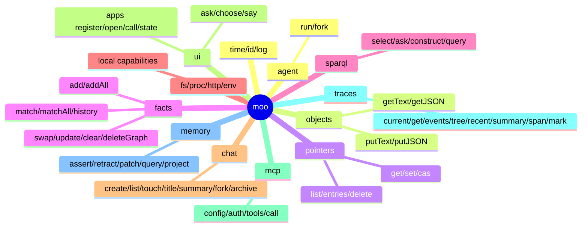

Native op declarations live in [`harness/src/ops.d.ts`](../harness/src/ops.d.ts). Rust implementations are grouped by capability under [`src/ops/`](../src/ops/):

| TypeScript namespace | Native/Rust area | What it backs |
| --- | --- | --- |
| `moo.objects`, `moo.pointers`, `moo.chat`, `moo.traces` | [`src/ops/store.rs`](../src/ops/store.rs), refs/store helpers | Content-addressed blobs, mutable refs, chat metadata, trace rows. |
| `moo.facts` | [`src/ops/facts.rs`](../src/ops/facts.rs) | RDF-like quad stores and graph history. |
| `moo.sparql` | [`src/ops/sparql.rs`](../src/ops/sparql.rs) | SPARQL over fact stores. |
| `moo.fs` | [`src/ops/fs.rs`](../src/ops/fs.rs) | File reads/writes/globs/patching. |
| `moo.proc` | [`src/ops/proc.rs`](../src/ops/proc.rs) | Local subprocess execution. |
| `moo.http` | [`src/ops/http.rs`](../src/ops/http.rs) | HTTP fetch/stream primitives. |
| `moo.env` | [`src/ops/env.rs`](../src/ops/env.rs) | Environment lookup. |
| LLM streaming/auth support | [`src/ops/llm.rs`](../src/ops/llm.rs) + harness HTTP code | Provider requests, auth state, streaming accumulation. |

## 5. Harness control flow

The harness control flow is split between two runtimes:

- **Rust** owns the server, WebSocket ingress, worker pool, native ops, long-running chat driver loop, LLM streaming, and tool scheduling.
- **TypeScript harness code** owns command semantics: chat step planning, tool-call construction, generated app commands, memory/facts APIs, and the `moo` facade exposed to JS.

In one sentence: **the TypeScript harness decides what should happen next; the Rust driver makes it happen safely, concurrently, and observably.**

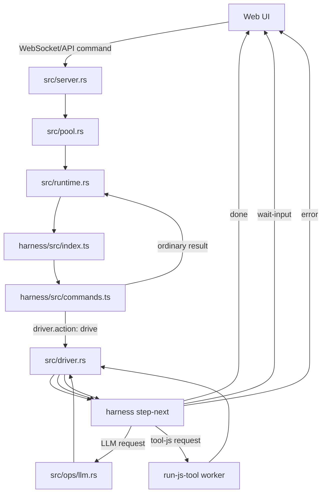

### 5.1 Boot and command entry

Rust embeds the bundled harness inside V8. [`harness/src/index.ts`](../harness/src/index.ts) installs the two important globals:

```ts
globalThis.moo = moo;
globalThis.main = dispatch;
```

[`src/runtime.rs`](../src/runtime.rs) evaluates the cached harness bundle and calls `globalThis.main(input)` for each command. [`harness/src/commands.ts`](../harness/src/commands.ts) maps command names to handlers and wraps command execution in traces.

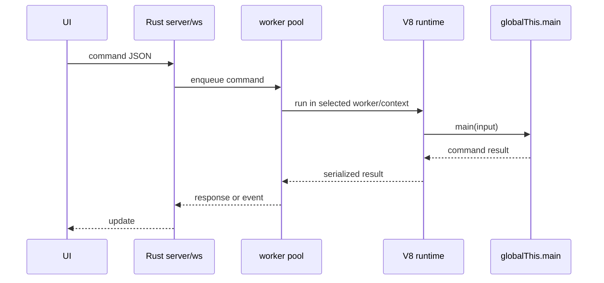

### 5.2 Worker-pool routing

[`src/pool.rs`](../src/pool.rs) decides where a command runs. Chat-driving commands are ordered with per-chat locks; independent tool/app work can run on async worker lanes, usually in fresh V8 contexts.

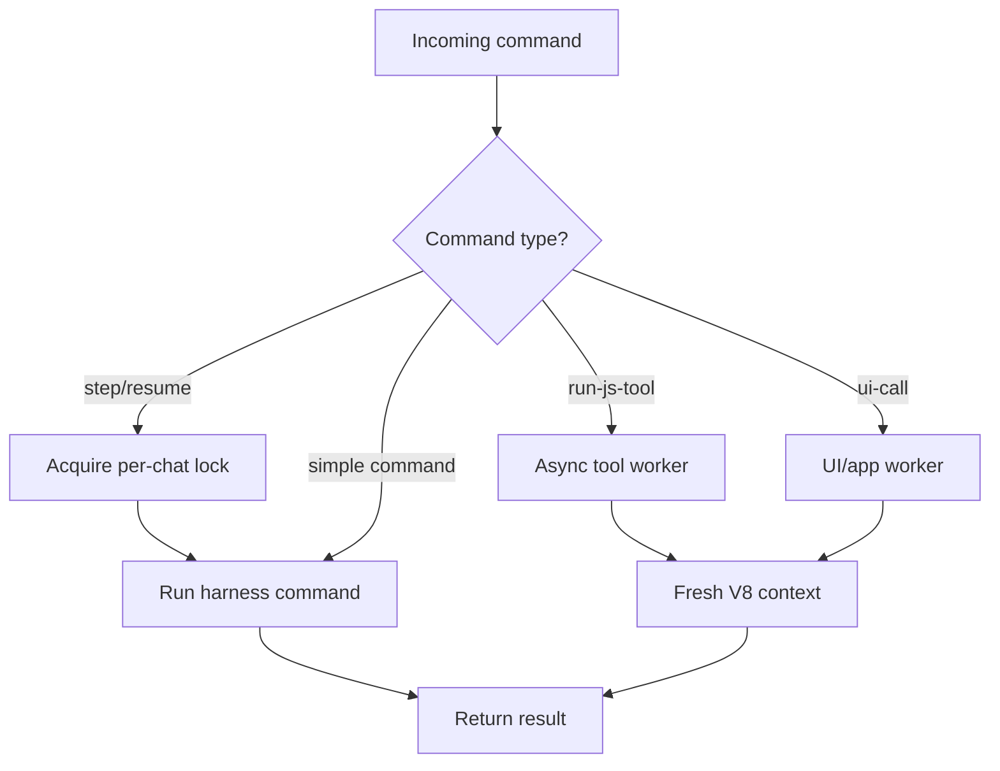

This is why a tool body sees scoped globals such as `moo`, `chatId`, `repo`, `scratch`, and optional `args`, but does not execute inside the same long-lived context as every other harness command.

### 5.3 Chat turns are driver actions

A user message does not make TypeScript synchronously run the entire assistant turn. The initial [`stepCommand`/`resumeCommand`](../harness/src/commands/step.ts) records or resumes the relevant timeline state, then returns a driver instruction:

```ts
{
  driver: {
    action: "drive"
  }
}
```

[`src/driver.rs`](../src/driver.rs) owns the long-running turn. It repeatedly calls the harness for the next action, performs native work outside V8 when needed, and feeds the result back into the harness.

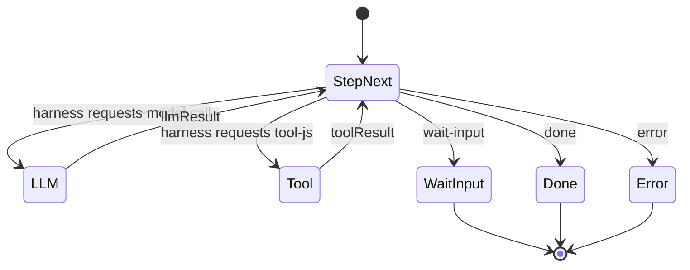

Pseudocode for the driver loop:

```ts
while (true) {
  const next = runHarness("step-next", state);

  if (next.kind === "llm") {
    const llmResult = await rustCallLlm(next.request);
    state = { ...state, llmResult };
    continue;
  }

  if (next.kind === "tool-js") {
    const toolResult = await runJsTool(next.tool);
    state = { ...state, toolResult };
    continue;
  }

  if (next.kind === "wait-input") break;
  if (next.kind === "done") break;
  if (next.kind === "error") break;
}
```

### 5.4 LLM and tool calls leave the harness loop

When the harness wants a model call, it returns a request description. Rust performs the actual streaming/cancellable provider operation through [`src/ops/llm.rs`](../src/ops/llm.rs), without holding the V8 runtime for the duration of the stream.

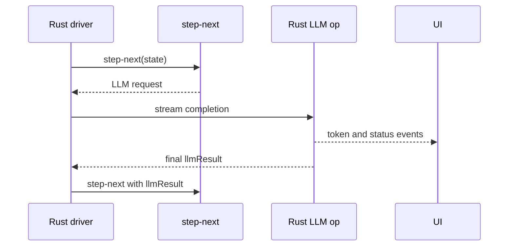

Tool calls follow the same mediator pattern. The harness emits a `tool-js` action; Rust schedules `run-js-tool`; the tool result is fed back into `step-next`.

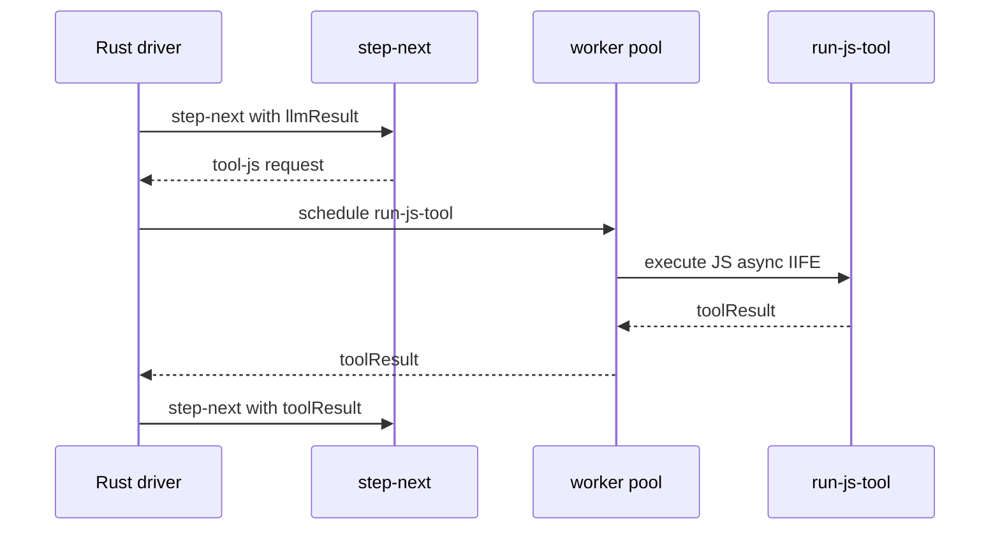

### 5.5 Terminal states and resume

The driver stops when the harness returns `done`, `error`, or `wait-input`. `wait-input` is terminal-for-now: the UI renders the pending ask/choose form, and a later submit/resume command restarts the same driver flow.

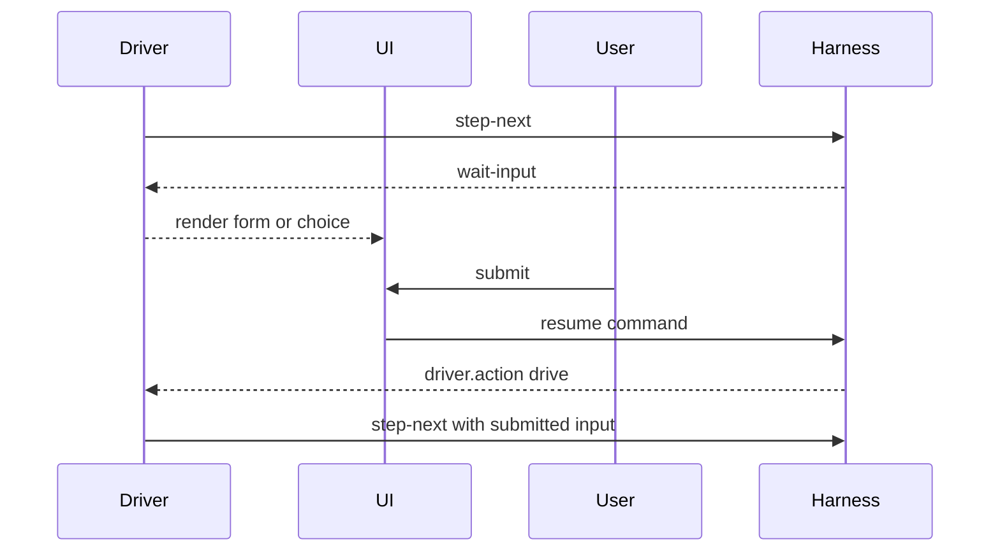

### 5.6 End-to-end turn

Putting the pieces together:

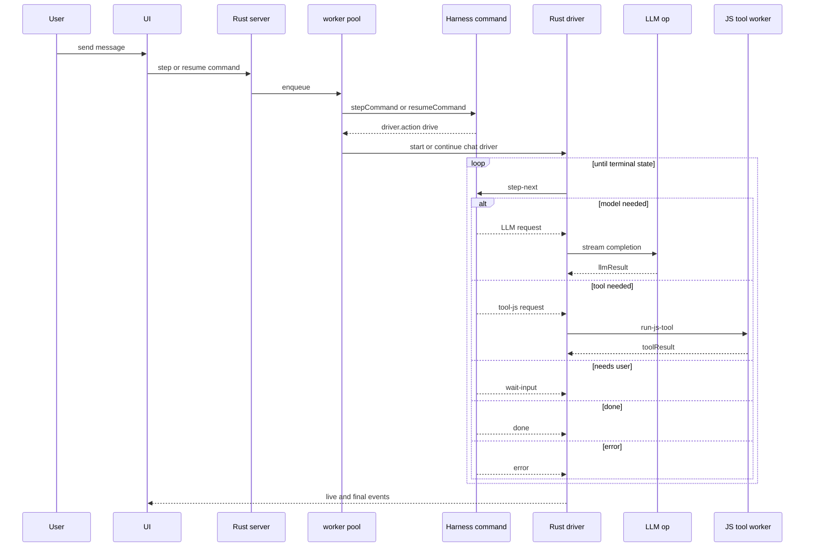

Key files:

- [`src/server.rs`](../src/server.rs) and [`src/ws.rs`](../src/ws.rs): HTTP/WebSocket ingress and event delivery.
- [`src/pool.rs`](../src/pool.rs): command scheduling, worker lanes, per-chat ordering, fresh contexts for tool/app work.
- [`src/runtime.rs`](../src/runtime.rs): V8 runtime, harness bundle evaluation, native op boundary.
- [`src/driver.rs`](../src/driver.rs): long-running chat driver loop.
- [`src/ops/llm.rs`](../src/ops/llm.rs): provider calls, streaming, and final LLM results.
- [`harness/src/index.ts`](../harness/src/index.ts): exposes `moo` and `main`.
- [`harness/src/commands.ts`](../harness/src/commands.ts): command router and tracing wrapper.
- [`harness/src/commands/step.ts`](../harness/src/commands/step.ts): step/resume entrypoints plus `run-js-tool` command handling.
- [`harness/src/driver/step.ts`](../harness/src/driver/step.ts): harness-side reducer/planner for the next driver action.
- [`harness/src/agent.ts`](../harness/src/agent.ts): prompt assembly, model request construction, tool definitions, compaction, and usage accounting.
- [`harness/src/moo.ts`](../harness/src/moo.ts): agent-facing facade over native capabilities.

## 6. Step timeline model

Moo stores chat history as append-only-ish timeline steps plus object payloads. Large payloads are written to content-addressed objects, and steps point at hashes.

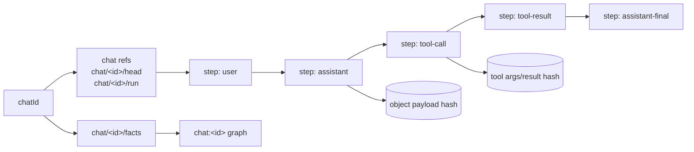

This design lets the UI render a timeline, lets tools attach durable artifacts, and lets agents query facts/memory without stuffing large values into RDF objects.

## 7. Storage primitives

Most harness state is made out of three low-level primitives:

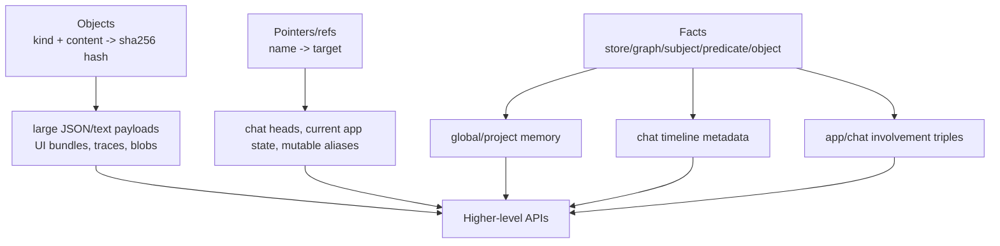

Rules of thumb:

- Put large or structured payloads in `moo.objects`, then store hashes in facts or steps.
- Use `moo.pointers.cas` when concurrent writers could race.
- Use `moo.facts` for graph-local assertions and `moo.memory` for durable user/project knowledge.
- Use `moo.sparql` when you need joins, optionals, filters, paths, or graph-scale summaries.

## 8. Traces

Every substantial command/tool call can leave a trace tree. The trace API is exposed to agents and rendered by the UI.

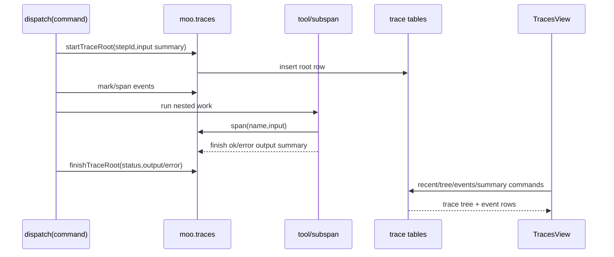

Trace payloads are summarized/redacted in the harness before persistence, so the UI can show useful execution structure without blindly dumping every byte.

## 9. Web UI feedback loop

The web app is not just a chat box. It is the live inspector for commands, traces, memory, files, apps, MCP state, and diffs.

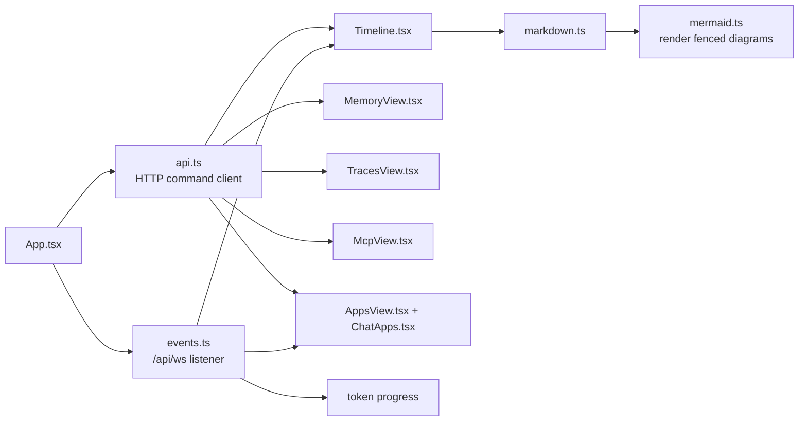

Relevant files:

- [`web/src/api.ts`](../web/src/api.ts): HTTP client for harness commands.
- [`web/src/events.ts`](../web/src/events.ts): WebSocket event subscription.
- [`web/src/Timeline.tsx`](../web/src/Timeline.tsx): chat/timeline rendering.
- [`web/src/TracesView.tsx`](../web/src/TracesView.tsx): trace browser.
- [`web/src/MemoryView.tsx`](../web/src/MemoryView.tsx): memory/facts interface.
- [`web/src/AppsView.tsx`](../web/src/AppsView.tsx), [`web/src/ChatApps.tsx`](../web/src/ChatApps.tsx): generated app registry and per-chat app instances.
- [`web/src/markdown.ts`](../web/src/markdown.ts), [`web/src/mermaid.ts`](../web/src/mermaid.ts): Markdown and Mermaid rendering.

## 10. Generated apps

Agents can register local UI apps. The manifest and bundle are stored, indexed in memory/facts, and opened into a chat by writing involvement triples and state pointers.

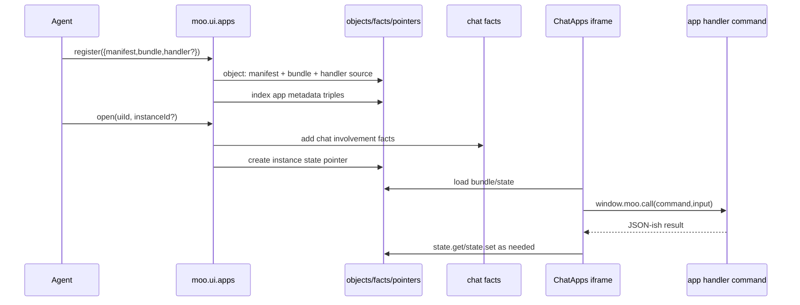

Inside an app iframe, `window.moo` is intentionally smaller than the agent API: state, handler calls, app opening, and memory helpers.

## 11. MCP integration

MCP servers are configured through the harness, authenticated when needed, listed for prompts/tool discovery, and called from agent work.

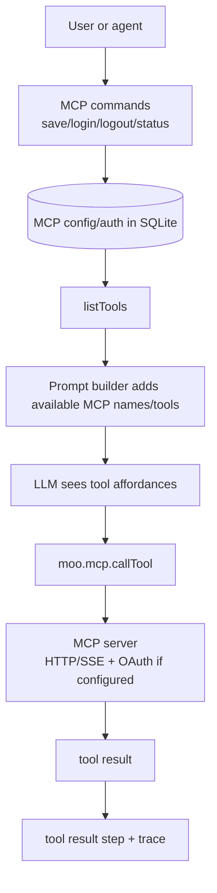

Code map:

- [`harness/src/commands/mcp.ts`](../harness/src/commands/mcp.ts): config, OAuth, list tools, call tool.
- [`harness/src/prompt.ts`](../harness/src/prompt.ts): prompt lines mentioning available MCP servers/tools.
- [`web/src/McpView.tsx`](../web/src/McpView.tsx): setup UI.

## 12. Subagents

Subagents are independent chat runs started from the current harness. They are useful when work can be isolated, parallelized, or summarized back to a parent turn.

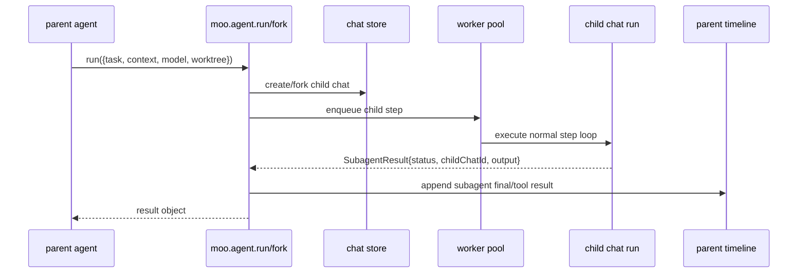

Subagents reuse the same primitives: commands, steps, traces, objects, pointers, facts, and worktrees. The difference is orchestration and result collection, not a separate runtime model.

## 13. Native capability boundary

The harness cannot call Node APIs directly; it runs in a V8 context with explicit native functions. That is intentional: capabilities are named, inspectable, and backed by Rust.

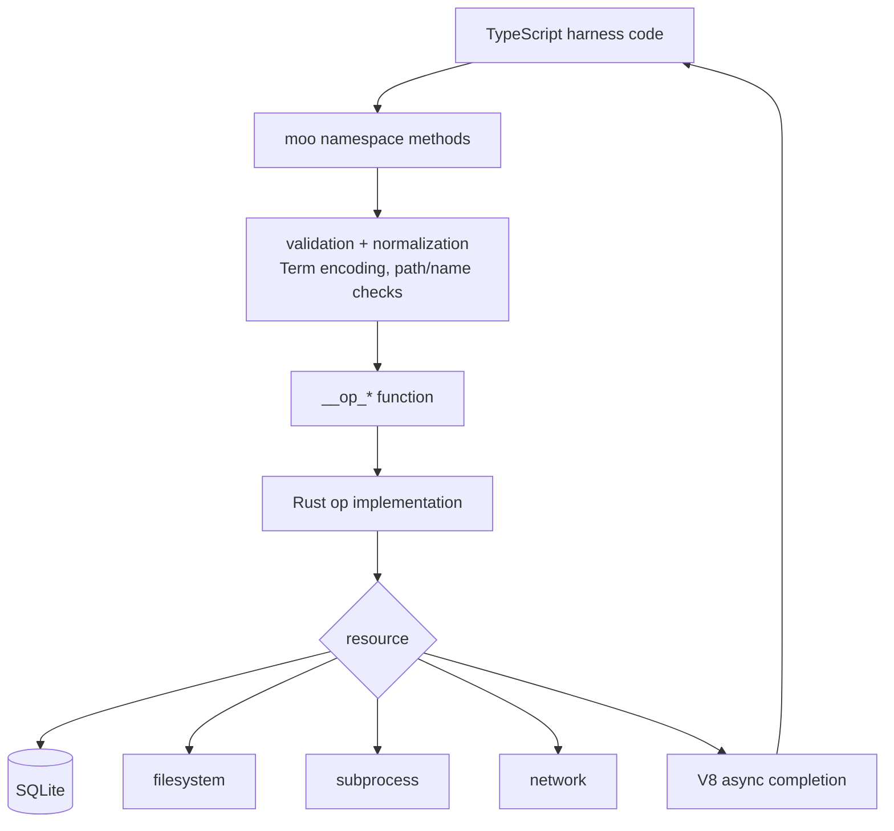

That shape makes it easier to audit tool behavior:

1. Find the public method in [`harness/src/moo.ts`](../harness/src/moo.ts).
2. Follow its `__op_*` call to [`harness/src/ops.d.ts`](../harness/src/ops.d.ts).
3. Find the Rust implementation under [`src/ops/`](../src/ops/).
4. Inspect how the result is recorded in steps, facts, objects, pointers, or traces.

## 14. Development loop

The repository has three build surfaces:

```mermaid
flowchart LR
  Harness[harness/package.json<br/>bun build src/index.ts] --> Bundle[harness/dist/harness.js]
  Web[web/package.json<br/>vite build] --> Assets[embedded web assets]
  Rust[Cargo.toml<br/>cargo build/test] --> Binary[moo]
  Bundle --> Binary
  Assets --> Binary
```

Common development references:

- [`process-compose.yaml`](../process-compose.yaml): local multi-process dev loop.
- [`flake.nix`](../flake.nix): Nix shell/release environment.
- [`harness/package.json`](../harness/package.json): harness bundle scripts.
- [`web/package.json`](../web/package.json): web app scripts and dependencies.
- [`Cargo.toml`](../Cargo.toml): Rust binary and dependencies.

Per [`AGENTS.md`](../AGENTS.md), run commands through `direnv exec .` after `direnv allow` when working in this repo.

## 15. How to read a new feature

When investigating a feature, trace it in this order:

```mermaid
flowchart TD
  A[Start from UI action or agent API] --> B{Which surface?}
  B -->|web click| C[web/src component]
  B -->|agent call| D[harness/src/moo.ts]
  B -->|chat command| E[harness/src/commands.ts]
  C --> E
  E --> F[command module]
  F --> G[agent/steps/helper module]
  D --> H[__op_* native boundary]
  G --> H
  H --> I[src/ops/*.rs]
  I --> J[(SQLite/files/proc/network)]
  F --> K[trace/step/fact/object effects]
  K --> L[WebSocket event]
  L --> C
```

A few examples:

- **Markdown Mermaid rendering:** [`web/src/markdown.ts`](../web/src/markdown.ts) emits `.mermaid` placeholders; [`web/src/mermaid.ts`](../web/src/mermaid.ts) observes and renders them.
- **A tool call:** [`harness/src/agent.ts`](../harness/src/agent.ts) defines/executes tools; each tool normally delegates to `moo.*`; native work lands in [`src/ops/`](../src/ops/).
- **Memory query:** UI calls a command in [`commands/memory.ts`](../harness/src/commands/memory.ts); agents call `moo.memory`/`moo.facts`/`moo.sparql`; Rust evaluates store queries.
- **Trace browser:** commands/tool helpers write trace rows via `moo.traces`; [`web/src/TracesView.tsx`](../web/src/TracesView.tsx) reads recent/tree/summary commands.

## 16. Design invariants

- **Local-first:** the normal control plane is the local binary and local SQLite database.
- **Explicit capabilities:** harness code gets named `__op_*` functions, not unrestricted Node APIs.
- **Inspectable state:** steps, traces, objects, pointers, facts, diffs, app state, and MCP config are queryable.
- **Small primitives, rich composition:** objects + refs + facts support chats, apps, memory, traces, summaries, and artifacts.
- **UI as inspector:** the web shell is a live view over persisted/streamed state, not the owner of agent execution.
- **Mermaid-friendly docs:** architecture flows should be diagrams first when a sequence or graph clarifies the code path.
