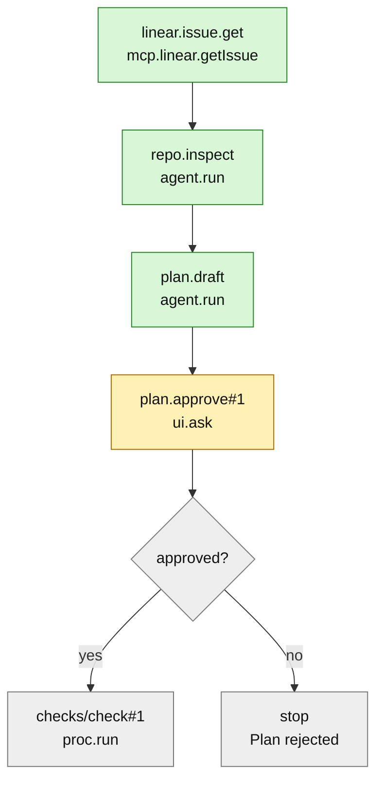

# Workflow plan

Moo workflows are first-class run objects with their own view. They are authored with a compact TypeScript/JavaScript DSL that emits declarative JSON IR. The harness loads JSON only; it should not carry a TypeScript compiler. Execution is a durable interpreter over blob-backed JSON IR, modeled with **pointers for current blobs and mutable run state** and **RDF graphs for queryable relationships**.

Non-goal: workflows do **not** spawn chats. Chats can start or link to workflow runs, but workflow execution never creates chats as steps, outputs, or side effects.

## Authoring shape

```ts
export default moo.workflow('linear', w => {
  const i = w.input;
  const s = w.state;

  return w.flow(
    w.step('linear.issue.get')
      .mcp.linear.getIssue({ id: i.issue })
      .out(s.ticket),

    w.step('repo.inspect')
      .agent.run({
        label: 'Inspect repo',
        task: 'Find relevant files, tests, conventions, and risks.',
        context: { ticket: s.ticket, notes: i.notes },
      })
      .out(s.repo),

    w.step('plan.draft')
      .agent.run({
        label: 'Draft plan',
        task: 'Draft a focused implementation plan.',
        context: { ticket: s.ticket, repo: s.repo },
      })
      .out(s.plan),

    w.step('plan.approve')
      .ui.ask({
        spec: {
          title: 'Approve plan',
          fields: [
            { id: 'ok', type: 'boolean', label: 'Approve?' },
            { id: 'notes', type: 'textarea', label: 'Feedback' },
          ],
        },
        context: { plan: s.plan },
      })
      .out(s.approval),

    w.when(w.not(s.approval.ok), w.stop('Plan rejected.')),

    w.loop('checks', { max: 5 },
      w.step('check')
        .proc.run({ cmd: 'direnv', args: ['exec', '.', 'bin/check'] })
        .out(s.check),

      w.break(w.eq(s.check.code, 0)),

      w.step('check.fix')
        .agent.run({
          label: 'Fix checks',
          task: 'Fix failing checks without broadening scope.',
          context: { plan: s.plan, check: s.check },
        }),
    ),

    w.when(s.linearApproval.ok,
      w.step('linear.comment.post')
        .mcp.linear.createComment({ issueId: i.issue, body: s.summary }),
    ),

    w.done({ summary: s.summary }),
  );
});
```

The DSL is only an authoring layer:

```text
workflows/linear.workflow.ts   -> build/dev transform -> .moo/workflows/linear.workflow.json
```

The emitted JSON IR is the canonical runtime artifact. The build/dev transform stores it as an immutable object/blob, updates a current-definition pointer, and indexes RDF metadata from that blob. The loader may cache decoded IR by blob hash, but agents and harness code inspect, run, retry, fork, and debug workflows from the blob-backed definition, not TypeScript source.

## DSL surface

```ts
moo.workflow(id, w => w.flow(...nodes))

w.input.issue              // ref: input.issue
w.state.ticket             // ref: state.ticket

w.step(id).mcp.linear.foo(args)
w.step(id).agent.run(args)
w.step(id).proc.run(args)
w.step(id).ui.ask(args)    // run-view/global waiting UI, not chat-owned

node.out(w.state.x)

w.loop(id, opts, ...nodes)
w.when(expr, ...nodes)
w.break(expr)
w.set(ref, value)
w.stop(reason)
w.done(value)

w.op(name, ...args)       // primitive expression form
w.eq(a, b)
w.not(x)
w.concat(...xs)
w.trim(x)
```

Because output is declarative JSON, runtime decisions use DSL nodes instead of JavaScript control flow:

```ts
// no
if (s.review.ok) postComment();

// yes
w.when(s.review.ok,
  w.step('linear.comment.post').mcp.linear.createComment({ body: s.summary }),
);
```

Build-time composition is fine:

```ts
const check = (name: string) =>
  w.step(`check.${name}`).proc.run({ cmd: 'bun', args: ['test', name] });

return w.flow(check('unit'), check('integration'));
```

## Storage model: pointers + RDF

Use objects/blobs for immutable JSON documents, pointers for current mutable references, and RDF for queryable facts. Definition IR is stored as immutable JSON blobs; pointers name the current/latest blob. Large run blobs live in objects; frequently changing run state may use inline `json:` pointer targets.

```text
pointer workflow/linear/current        -> sha256:<workflow-ir-json>
pointer workflow/linear/source         -> json:{"path":"workflows/linear.workflow.ts","emitted":".moo/workflows/linear.workflow.json"}
pointer workflow/linear/version/1      -> sha256:<workflow-ir-json>

pointer workflow/run/run_123/input     -> sha256:<input-json>
pointer workflow/run/run_123/state     -> json:{...current durable state...}
pointer workflow/run/run_123/output    -> sha256:<output-json>        // when done
pointer workflow/run/run_123/events    -> sha256:<event-log-jsonl>     // append/compact
pointer workflow/run/run_123/lease     -> json:{"owner":"...","expiresAt":"..."}

pointer workflow/run/run_123/step/checks/check#2/args   -> sha256:<resolved-args>
pointer workflow/run/run_123/step/checks/check#2/output -> sha256:<step-output>
pointer workflow/run/run_123/step/checks/check#2/error  -> sha256:<error-json>
```

RDF indexes definitions, runs, steps, optional chat links, and waiting work:

```text
store workflow/facts
  graph workflow:linear          static workflow metadata + step index
  graph workflow-run:run_123     mutable run index + step cells
  graph workflow-waiting         global waiting projection

store chat/<chatId>/facts        optional, only for existing chats linked to runs
  graph chat:<chatId>            chat-local cards/apps involving runs
```

Definition facts:

```turtle
workflow:linear rdf:type moo:Workflow .
workflow:linear moo:id "linear" .
workflow:linear moo:title "Implement Linear ticket" .
workflow:linear moo:source pointer:workflow/linear/source .
workflow:linear moo:currentIr pointer:workflow/linear/current .
workflow:linear moo:irHash "sha256:..." .
workflow:linear moo:usesMcpServer mcp:linear .
workflow:linear moo:usesMcpTool "linear.getIssue" .
workflow:linear moo:usesMcpTool "linear.createComment" .
workflow:linear moo:usesProcCommand "direnv" .
workflow:linear moo:usesAgentRole "planner" .
workflow:linear moo:hasStep workflow-step:linear/linear.issue.get .
```

Run facts:

```turtle
workflow-run:run_123 rdf:type moo:WorkflowRun .
workflow-run:run_123 moo:workflow workflow:linear .
workflow-run:run_123 moo:status "waiting" .
workflow-run:run_123 moo:input pointer:workflow/run/run_123/input .
workflow-run:run_123 moo:state pointer:workflow/run/run_123/state .
workflow-run:run_123 moo:currentStep workflow-step-run:run_123/plan.approve#1 .
workflow-run:run_123 moo:workspaceRoot pointer:workflow/run/run_123/workspace .
```

Step-run facts:

```turtle
workflow-step-run:run_123/checks/check#2 rdf:type moo:WorkflowStepRun .
workflow-step-run:run_123/checks/check#2 moo:run workflow-run:run_123 .
workflow-step-run:run_123/checks/check#2 moo:logicalId "check" .
workflow-step-run:run_123/checks/check#2 moo:path "checks/check#2" .
workflow-step-run:run_123/checks/check#2 moo:kind "proc.run" .
workflow-step-run:run_123/checks/check#2 moo:status "done" .
workflow-step-run:run_123/checks/check#2 moo:args pointer:workflow/run/run_123/step/checks/check#2/args .
workflow-step-run:run_123/checks/check#2 moo:output pointer:workflow/run/run_123/step/checks/check#2/output .
workflow-step-run:run_123/checks/check#2 moo:trace trace:abc .
```

Optional chat-link facts, created only when a run is started from or manually attached to an existing chat:

```turtle
chat:tMQ53jfyEsbG moo:involvesWorkflowRun workflow-run:run_123 .
workflow-run:run_123 moo:linkedChat chat:tMQ53jfyEsbG .
workflow-run:run_123 moo:statusCard uiinst:workflow-card-run_123 .
uiinst:workflow-card-run_123 ui:statePointer pointer:workflow/run/run_123/cardState .
```

Human waits are step runs with waiting facts:

```turtle
workflow-run:run_123 moo:status "waiting" .
workflow-run:run_123 moo:waitingOn user:me .
workflow-run:run_123 moo:currentStep workflow-step-run:run_123/plan.approve#1 .
workflow-step-run:run_123/plan.approve#1 moo:kind "ui.ask" .
workflow-step-run:run_123/plan.approve#1 moo:status "waiting" .
workflow-step-run:run_123/plan.approve#1 moo:ask pointer:workflow/run/run_123/step/plan.approve#1/ask .
```

## Execution model

The runner interprets JSON IR. Each effectful node materializes a durable step path, then executes at most once unless explicitly invalidated.

```text
1. resolve refs/expressions against input, state, and run context
2. materialize step path, e.g. checks/check#2
3. if step output pointer exists and step status is done, reuse it
4. otherwise acquire/renew run lease
5. write step started facts and resolved args pointer
6. execute effect: mcp.call, proc.run, agent.run, ui.ask, etc.
7. store output/error object, update step facts
8. apply out/ref writes to state pointer
9. append event log and update run status/currentStep facts
```

The UI should not show this interpreter algorithm as the workflow diagram. Run diagrams are dynamic projections of the workflow IR plus current run facts; see the UI section.

`ui.ask` pauses instead of completing immediately. It writes `waiting` facts, updates the run view and global waiting projection, and resumes only when `moo.workflows.submit(runId, stepPath, value)` stores the answer as the step output. It may project into linked chats as a card, but the ask belongs to the run, not the chat.

Retries and forks are pointer/fact operations:

- retry step: clear that step's output/error pointers and set status back to pending;
- rerun from here: invalidate descendant step-run facts/pointers;
- fork from here: create a new run with copied input/state/events up to the chosen step;
- non-idempotent MCP writes and commits require explicit gates before retry.

Use pointer CAS on `workflow/run/<id>/lease` and `workflow/run/<id>/state` to avoid concurrent runners corrupting a run.

## Chat interplay

Workflow runs have their own primary view and may be attached to zero or more existing chats. Chats are optional control/notification surfaces; they are never spawned by workflow steps.

Starting from chat creates a run, links the existing chat in both stores, and posts a compact card:

```text
linear / MOO-123
✓ linear.issue.get
✓ repo.inspect
⏸ plan.approve#1

[Open run] [Approve] [Stop]
```

The chat should receive only meaningful transitions:

- run started;
- waiting for human input;
- failed step;
- run completed/cancelled.

Detailed progress, state, step args/outputs, traces, artifacts, retries, and forks live in the workflow run UI. A run can later be attached to an existing chat by adding `moo:linkedChat` / `moo:involvesWorkflowRun` facts; no workflow state moves into chat history.

## Thin API

Read APIs first:

```ts
moo.workflows.list()
moo.workflows.inspect(id)
moo.workflows.runs({ status?, chatId? })
moo.workflows.inspectRun(runId)
moo.workflows.waiting({ chatId? })
```

`list`, `runs`, and `waiting` are mostly SPARQL over indexed facts plus run pointers. `inspect(id)` resolves the workflow current-definition pointer, loads the IR blob, uses a hash-keyed decode cache, and rebuilds RDF metadata if the pointed blob hash changed.

Control APIs later:

```ts
moo.workflows.start(id, { input, chatId?, workspace? })
moo.workflows.submit(runId, stepPath, value)
moo.workflows.cancel(runId)
moo.workflows.retry(runId, { from })
moo.workflows.fork(runId, { from })
moo.workflows.linkChat(runId, chatId)
moo.workflows.unlinkChat(runId, chatId)
```

No `chat.create`, `spawnChat`, or workflow step kind creates chats.

## UI principle

Do not start with a visual builder. Start with a workflow debugger:

```text
Workflows
  Library
  Runs
  Waiting on me
  Failed
```

A run inspector shows input, current state pointer, step cells, artifacts, traces, source/current IR blob, and optional linked chats. Chat cards are projections of run state, not the state itself.

### Dynamic Mermaid run diagrams

The run inspector should include a live Mermaid diagram of the run's execution state. The diagram is generated on demand from:

- the current IR blob for structure, ordering, loops, and branches;
- RDF step-run facts for materialized paths and statuses;
- run pointers for current state, output, errors, and waiting asks.

The Mermaid source is a UI projection, not canonical state and not stored as the workflow definition. Re-render it whenever step facts or run pointers change.

Example projection:



Diagram behavior:

- each node maps to an IR node or materialized step path such as `checks/check#2`;
- node color/class comes from `moo:status`: pending, running, waiting, done, failed, skipped;
- clicking a node selects the step cell and shows args, output/error, trace, artifacts, and retry/fork actions;
- loops show materialized iterations, not just the logical loop node;
- branches show taken edges strongly and untaken/skipped edges muted;
- waiting `ui.ask` nodes render the answer form beside the diagram;
- compact chat cards may show a small diagram or linear slice, but the full diagram belongs to the run view.
